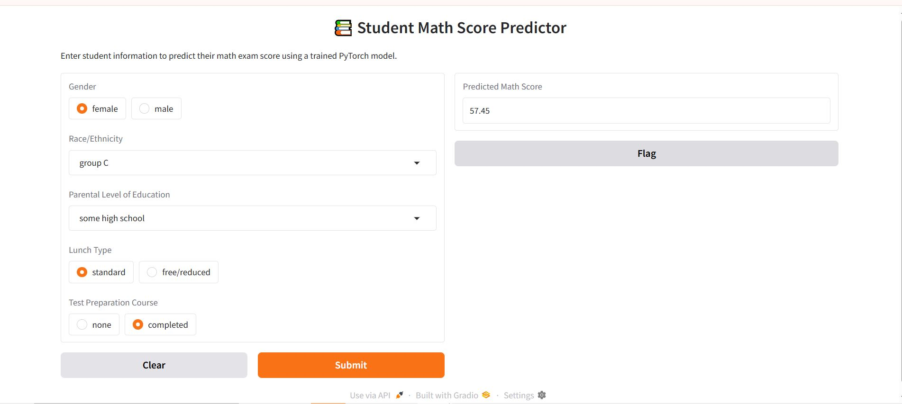
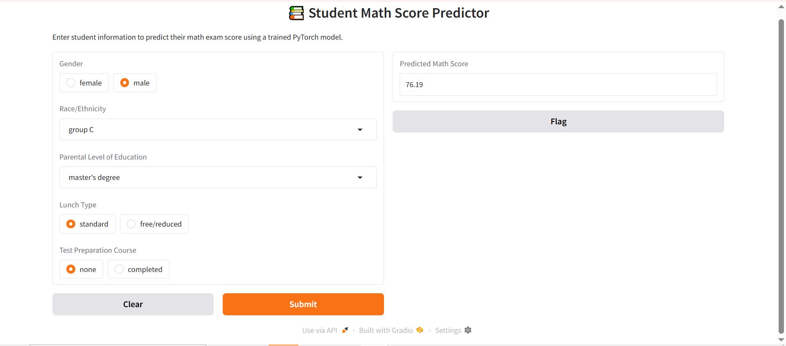

# 🎓 Student Math Score Predictor — PyTorch + Gradio

A deep learning model that predicts a student's math exam score based on demographic features.  
Built with **PyTorch**, deployed using **Gradio**, and ethically audited for **fairness across gender, race, and socio-economic background**.

> 🧠 Model architecture uses `nn.ModuleList` for dynamic layer stacking.  
> 📊 Fairness audit performed via group-wise error metrics — no sensitive columns used during training.

---

## 📌 Problem Statement

Build an interpretable, ethical, and deployable AI model that can predict student performance (math scores) using only demographic context.  
This includes checking whether the model is biased towards or against any group.

**Goal:** Predict `math score`  
**Dataset:** [Students Performance in Exams](https://www.kaggle.com/datasets/spscientist/students-performance-in-exams)

---

## 🧠 Key Features

| Feature                | Description |
|------------------------|-------------|
| ✅ PyTorch Model        | Custom `nn.ModuleList` for flexible architecture |
| ✅ Scikit-learn         | `ColumnTransformer` pipeline for preprocessing |
| ✅ Scaled Regression    | Target scaled using `StandardScaler` |
| ✅ Fairness Insights    | Bias diagnostics across groups |
| ✅ Gradio App           | Interactive app for score prediction |
| ✅ GitHub Ready         | Modular, reproducible, deployable

---

---

## Demo 
## 📷 Demo Screenshot

